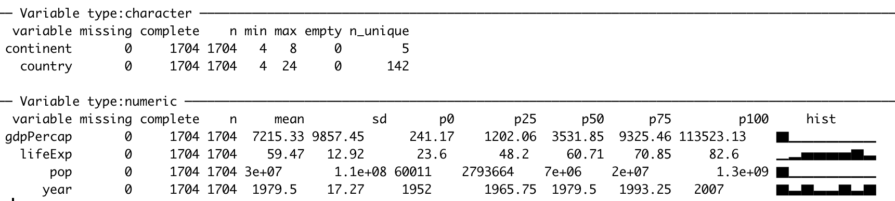

```{r setup, include=FALSE}
knitr::opts_chunk$set(echo = TRUE)
options(scipen=1, digits=2)
```

## Abstract

R is an excellent teaching tool for learning exploritory data analysis (EDA) and regression analysis. While Base R provides all the functionality needed to do many things, learning can be greatly enhanced through the use of add in packages for R that can boost students up the learning curve and allow them to rapidly accelerate their understanding R and analysis in general. Using packages including `tidyverse`, `GGally`, `esquisse`, and `lindia` this paper walks through an example of basic EDA and regression analysis that might be used in an introduction class along with code examples of every step. Helping students up the learning curve of R can give them a platform on which to learn modeling and analysis as well as a set of skills they can take with them into industry or future academic persuits. 


## Introduction

The Father of Modern Econometrics, Adam Smith, once frustratingly stated:

> The discipline of colleges and universities is in general contrived, not for the benefit of the students, but for the... ease of the masters. [@smith]

<!-- > The discipline of colleges and universities is in general contrived, not for the benefit of the students, but for the interest, or more properly speaking, for the ease of the masters. -->

<!-- https://www.adamsmith.org/adam-smith-quotes -->
<!-- This article is in the lit review folder -->

Adam Smith is making the claim that methods of instruction used by professors are those which are easiest for the instructor, but not necessarily what is best for the student. This is understandable, as research and other administive demands force instructors to rely on tried teaching techniques which are familiar to the teacher and possibly not what will equip the student to be most successful in their career.

The authors of this article will make the case that the R open sourse statistical programming languge can bridge this gap between a Smith's proverbial teacher's ease and a student's benefit. As R continues to be one of the more popular coding languages for statistical analysis with ever increasing technical support, the barrier for entry keeps falling. There are many tools available as add-ons to R which can aide the teaching process to get students loading and exploring data quickly with manageable overhead for the instructor. With ample open source support, a wide acceptance in industry, and many additional features to explore and present data, teaching with R both satisfies the ease for the instructor and has long term benefit for the students. Learning the basics of R means students have a tool set that they can take with them to either future academic careers paths or apply in industry. 

The the growth of the R Language can be appreciated if we look at the growth in R questions being asked on the popular question and answer site, Stack Overflow:[@stack]

```{r stackoverflow, fig.cap='R Growth on Stack Overflow', echo=FALSE, out.width = "300px", message=FALSE, warning=FALSE, fig.align='left', dpi=300}
# url <- "https://data.stackexchange.com/stackoverflow/csv/614151"
# dat <- read_csv(url)
# write_csv(dat, "01_data/stackoverflow.csv")
library(tidyverse)

read_csv("01_data/stackoverflow.csv") %>%
  mutate(Month = as.Date(Month)) %>%
  filter(TagName == 'r') ->
  so_r_data

ggplot(so_r_data) +
  aes(x = Month, y = Questions) +
  geom_line(size = 1.25, colour = "#0c4c8a") +
  labs(x = "Month", y = "Questions", title = "R Questions on Stack Overflow") +
  theme_bw()

```

Equiping students  with a popular tool that enables them to work quickly while learning is something we are certain Adam Smith would be proud of.

## The R Ecosystem

The advantages to using R whether in an academic setting or industry are myriad. Since R and all the tooling we discuss below are open source, they have no financial costs to adoption. In addition, R has a very rich ecosystem of add-on packages that expand R and add functionality. These packages add features ranging from adding ability to connect to commercial database systems to implementation of new machine learning algorithms. 

### CRAN 

The online home of R is the Comprehensive R Archive Network, CRAN. CRAN is where a new user can download R and access packages that expand the functionality of R. There are currently more than 10,000 R packages hosted on CRAN for free download [@cran]. Some new users to R are overwhelmed by the sheer volume of packages. To help make sense of the CRAN ecosystem, CRAN has published CRAN Task Views which organize popular packages into categories of use (e.g. econometrics or spatial statistics). The task views are written and maintained by a subject matter expert. There are more than 35 such task views which can help new R users make sense of the packages availiable in their areas of interest and know which packages are recommended by an expert in their domain of interest. This can give instructors and students a curated view into packages that might match their interests or field of study: https://cran.r-project.org/web/views/

### RStudio

When R is downloaded from CRAN, it comes with an engine for executing R code along with a few core packages for doing statistical analysis and graphics. Collectively these tools are refered to as "Base R". Base R comes with a basic text editor for editing and executing R scripts However, most users quickly discover that writing R code is easier with an integrated developemnt environment (IDE). The most popular IDE for R is RStudio Desktop which we highly recommend for teaching.

RStudio Desktop can be downloaded for free from RStudio.com. In additon to the desktop IDE, RStudio makes a server based IDE for using R on remote machines. RStudio Server is also availiable in a professional version that offers more features such as authentication and collaborative editing. RStudio offers its professional tools to academics for free. Go to https://www.rstudio.com/pricing/academic-pricing/ for more info. 

For many instructors, the freely availiable RStudio.cloud service (http://rstudio.cloud) greatly simplifies instruction by providing a fully functional and configured R and RStudio environment running on cloud hosted hardware. For the rest of this article we will exclusivly use RStudio.cloud in our examples. Instructors can set up projects in RStudio.cloud and share those projects with students to simplify distributing course material.

```{r icons, fig.cap='RStudio.cloud', echo=FALSE, eval=TRUE, fig.width=4, fig.height=3}
knitr::include_graphics("03_figures/rstudio.cloud.png")
```

Instructors who do not want to use the cloud solutions, or can't because of connectivity restrictions, can download and install R and RStudio on local hardware. For details on downloading and installing, see section 1.1 in R Cookbook [@teetor_long], available online at https://rc2e.com/gettingstarted#recipe-id001.

### Projects

RStudio introduces a powerful organizational tool called an RStudio Project. Projects help users by doing the following:

- Storing RStudio project settings
- Restoring window position in RStudio so when a project is closed and repoened, window contents are preserved.
- Setting the working directory 

RStudio creates a project file with an *.Rproj* extension in the project directory. RStudio also creates a hidden directory, *.Rproj.user*, for temporary files related to your project.

We've found that helping students organize their files using projects from the start helps them build good practices and prevent lost files and file path related issues that can flummox new learners. Although instructors should expect to teach the basics of absolute and relative file paths, as this concept is sometimes new to learners and can slow learning. 

### Tidyverse

In addition to the RStudio IDE, the RStudio company supports the development of a number of open source packages designed to work together to make R easier to use and faster to learn. These libraries are collectivly known as the "Tidyverse". The most concise definition of the Tidyverse comes directly from its originator and core maintainer, Wickham[@rstudioblog]:

> The tidyverse is a set of packages that work in harmony because they share 
> common data representations and API design. The tidyverse package is designed 
> to make it easy to install and load core packages from the tidyverse in a 
> single command. The best place to learn about all the packages in the 
> tidyverse and how they fit together is *[R for Data Science](http://r4ds.had.co.nz)*.


The authors have had very good experiences with introducing learners to the Tidyverse from the very beginning of the learning journey because these tools help learners see very quick successes which, in turn, keeps them engaged in the learning process. The popular plotting package `ggplot2` and the data manipulation package `dplyr` are both core Tidyverse packages. 

The Tidyverse meta-package, like any CRAN package, can be installed from the R Console:

```{r tidy, eval=FALSE, include=TRUE}
install.packages("tidyverse")
```

#### Tidyverse Packages
When a user installs the Tidyverse, 19 packages are installed [@dustysreference;@jdsreference]. Then when the user loads the tidyverse using `library(tidyverse)` a core subset of 8 packages are loaded into R. To use any of the pacakges not loaded with the core Tidyverse a user must explicitly load those packages (e.g. `library(readxl)`) or call the packages using the package name prefix (e.g. `readxl::read_xlsx()` to run the `read_xlsx()` function from the `readxl` package).

The packages listed below are in the "Core Tidyverse" and get loaded with `library(tidyverse)`. 

***Core Tidyverse***

`ggplot2`: data visualization  
`dplyr`: data manipulation   
`tidyr`: data reshaping  
`readr`: data import  
`purrr`: functional programming   
`tibble`: tidy dataframes   
`stringr`: string manipulation   
`forcats`: factor use   

***Additional Tidyverse***

There are 11 additional Tidyverse packages that get installed, but not automatically loaded. These add specialized functions for more specialized uses. [@dustysreference;@jdsreference]

*Import*

`readxl`: reading Excel files  
`haven`: reading SPSS, Stata, and SAS data  
`jsonlite`: manipulating JSON   
`xml2`: reading xml   
`httr`: accessing web APIs  
`rvest`: web scraping  
`feather`: data sharing with Python and beyond  

*Wrangle*

`lubridate`: date manipulation   
`hms`: time-of-day manipulation

*Modeling* 

`modelr`: modeling pipelines  
`broom`: takes model results and makes them tidy

<!-- i used what's on https://github.com/tidyverse/tidyverse... I'm assuming this is the most up to date -->

More info on each can be found at https://tidyverse.tidyverse.org

## Harnessing The Power of R, Tidyverse, and other Helpful Packages 

In the following sections, we will highlight some of the features of R and the `tidyverse` and how they can be useful in a classroom setting while teaching new students. The reader will notice the authors use many packages to support their analysis and recommend teachers do the same when instructing students. These prebuilt, add-on packages make syntax simple, easy to interpret, and less intimidating for new users. 

### Loading Data (Gapminder)

To aide our instructions, we will explore the Gapminder data set. The Gapminder dataset is created by the Gapminder Foundation which is a non-profit which promotes sustainable global development[@gapminder].

Showing students how to load in example data is a crucial first step. Data can be easily loaded from the local file system:

```{r readdata, message=FALSE, warning=FALSE}
library(tidyverse)
gapminder <- read_csv("01_data/gapminder.csv")
```

Or directly from a URL:

```{r readdata2, eval=FALSE, message=FALSE, warning=FALSE, include=FALSE}
gapminder <- read_csv("https://github.com/CerebralMastication/r_for_the_student/blob/master/01_data/gapminder.csv")
```

> As a quick aside, a common stumbling block for students is executing lines of code. RStudio makes this simple. `Ctrl` + `Enter` (for Windows) or `Command`+`Enter` (for MAC) will execute the line of code where the cursor currently exists. Students can also execute multiple lines of code by highliting the desired code and pressing `Ctrl` + `Enter` (or `Command`+`Enter`).

Once the student reads the the data into R, the environment tab in the top right of the computer will reflect that the data is loaded. 

```{r icons2, fig.cap='Environment With Gapminder Data', echo=FALSE, eval=TRUE, out.width = "300px"}
knitr::include_graphics("03_figures/environment.png")
```

### Initial Data Exploration

Simply printing the resulting data frame can tell students a bundle of information about the data just loaded. Let's look at the output below.

```{r showgapminder, eval=TRUE, message=FALSE, warning=FALSE,include=TRUE}
gapminder
```

From the output above, one can see the `gapminder` dataset is a `tibble` consisting of 1,704 observational units with 6 columns of information. When reading in data, the `read_csv` command identifies the most likely class of data for each column. When we print the data out in R, the display lists the class below the column name. We can see that we have a mix of `character`s and `double`s. A `tibble` is a Tidyverse take on R's traditional `data.frame`. We've found that it usually is sufficient to tell students that `tibble` is a table. Since the goal is to get students using data to *do* things we often do not spend excessive time on definitions and instead focus on getting students doing something interesting. 

Students also notice that printing out the data does not provide all the information they would like to know. One can see that the data has information about countries, but are they all Afghanistan? Likely no, as you can see there are 1,694 more rows and they probably are not all Afghanistan. Let's look at other ways to understand the data. 

We recommend using the `skim` command from the `skimr` library[@skimr]. You may need to download the `skimr` package from CRAN.

```{r installskimr, eval=FALSE, message=FALSE, warning=FALSE, include=TRUE}
install.packages("skimr")
```

<!-- What is your hack to make the histograms print out correctly? -->

```{r showskimr, echo=TRUE, eval=FALSE }
library(skimr)
skim(gapminder)
```

```{r skimrimage, fig.cap='Environment With Gapminder Data', echo=FALSE, eval=TRUE}

```

This gives students a much better view of the data. `skim` separates the data by class and provides important information for each data type. We find that the `skim` function gives students the quickest and best description of the data. Other options of presenting detailed information about the data include the `summary(gapminder)` and `glimpse(gapminder)`. But we typically only teach one of these just get the students looking at the data and not worrying with pros and cons of each way of looking at the data. 

In the output above, for each class of data (`character`/`numeric`), `skim` provides how many missing, complete, and total (n) observations for each column.

For the character class, `skim` provides additional information about each column. This includes the min/max length of each character string as well as the number of unique (n_unique) observations. 

For the numeric class, `skim` provides mean, standard deviation (sd), and percentile breaks (p0, p25,...,p100). It also provides a small histogram to help visualize the distribution of your numeric data (hist).

This clearly doesn't get the student to a full understanding of a dataset, but it's a good start.  With just a `skim` the student still does not understand which countries are in the data among other curiosities. We will provide more in-depth methods of understanding the data in the plotting and Exploratory Data Analysis (EDA) section after we look briefly at the 6 `dplyr` verbs that allow students to begin rapidly understanding the data.  

### dplyr Verbs

Almost any time a student works with data, they will need to manipulate that data in some way. Below, we will introduce the main 6 `dplyr` verbs to help wrangle data to gain additional insight. These verbs, `select`, `filter`, `mutate`, `group_by`, `summarize`, `arrange` are explained in detail below. 

In order to motivate a student's use of the aforementioned verbs, we'll look to answer the following question: 

**What is the average GDP per country since 1980?**

#### Verb 1: select

To begin, we only need to work with certain columns. The relevant columns to this question are `country`, `year`, `pop`, and `gdpPercap`. We can make this selection using the `select` function. The first argument in the `select` function is the data we which to select from. The subsequent arguments are the names of the columns from the data we wish to select. In the code below, we save our selected columns into a new `tibble` called `gapminder_selected`.

```{r selected}
gapminder_selected = select(gapminder, country, year, pop, gdpPercap)

gapminder_selected 
```

Once we view the data, we see that we now have 1704 rows but only 4 columns. 

#### Verb 2: filter

To further answer our question, we need to filter our data down to the years of interest. We can achieve this goal using the `filter` function. Like the `select` function, the first argument in the `filter` function is the data and subsequent argument is the logical statement of which you wish to filter. In the code below, we filter our selected data and save our filtered data into a new tibble called `gapminder_filtered`.

```{r filtered}
gapminder_filtered = filter(gapminder_selected, year >= 1980)

gapminder_filtered
```

Once we view the data, we see that our data now consist of 852 rows, representing the years since 1980.

#### Verb 3: mutate

The next step in answering our question is creating a column that contains the information of interest. The `mutate` function creates new columns according to a specific function that we provide. To answer our question, we need to determine the GDP in each year. To find the GDP, we need to multiply the `gdpPercap` by the `pop`. Similar to the previous two verbs, the first argument in the `mutate` function is the data. Subsequent arguments are columns you wish to create with corresponding formulas. In the code below, we mutate our filtered data and save our mutated data into a new tibble called `gapminder_mutated`.

```{r mutated}
gapminder_mutated = mutate(gapminder_filtered, GDP = gdpPercap * pop)

gapminder_mutated
```

Once we view the data, we see the new column, `GDP`, has been added to the end of our tibble. 

#### Verb 4: group_by

The next step in answering our question will be to group our data by the field of interest. In this instance, since we want to know GDP by country, we need to group the data by country. A way to conceptualize this step is to think of placing each group of data into a specific room. In subsequent steps we will apply a function to each group (or room) of data. Just like the previous verbs, the first argument in the `group_by` function is the data. The following arguments are the columns you wish to group by. In the code below, we group our mutated data and save our grouped data into a new tibble called `gapminder_grouped`.

```{r grouped}
gapminder_grouped = group_by(gapminder_mutated, country) 

gapminder_grouped
```

The reader will notice that there appears to be no change to the data. This is mostly true as we have simply told R that we would like to apply future functions over each group of data instead of over the entire tibble. The only difference in output is a note explaining the what the data has been grouped into and the number of groups. In this case, it explains the data is grouped by `country` and that there are 142 groups. 

#### Verb 5: summarise

Next, in order to determine the average GDP by country, we need to apply a function to each group we have identified. In this instance, we will need to take the average GDP over each continent. Since we've already grouped by country, we next need to apply the summarise function. Like the previous verbs, the first argument in the `summarise` function is the data. The following arguments are the function to apply to each group. In the code below, we summarise the grouped data and save the summarised data into a new tibble called `gapminder_summarised`.

```{r summarise}
gapminder_summarised = summarise(gapminder_grouped, AVG_GDP = mean(GDP))

gapminder_summarised
```

We now have an answer to our question. The tibble above shows the average GDP per country since 1980. 

#### Verb 6: arrange

However, we can refine our result to provide more understanding. Currently, our data is sorted alphabetically by country. This does not provide much insight. We can use the `arrange` function to sort the data by average GDP; either ascending or descending. Like all other verbs, the first argument in the `arrange` function is the data. The following arguments are the column you wish to sort by. In the code below, we arrange our summarised data and save our arranged data into a new tibble called `gapminder_arranged`.

```{r arranged}
gapminder_arragned = arrange(gapminder_summarised, AVG_GDP)

gapminder_arragned
```

We see, from the output above, the countries with the smallest average GDP since 1980. 

It may be more interesting, however, to sort the average GDP in descending order so we can learn the countries with the highest average GDP. To do this we simply place a `-` sign in front of `AVG_GDP` in the call above. 

```{r arrangeddesc}
gapminder_arragned_descending = arrange(gapminder_summarised, -AVG_GDP)

gapminder_arragned_descending
```

#### Simplifying Code with the Pipe Operator: `%>%` 

After helping learners see how each function works we can introduce the pipe operator (`%>%`) that can be used to chain together commands and pass the results of one function directly into the next function. This can result in very logical data manipulation steps that are easy to learn and easy to understand:

```{r pipechain}
gapminder_arragned_descending_chained =
  gapminder %>%
  select(country, year, pop, gdpPercap) %>%
  filter(year >= 1980) %>%
  mutate(GDP = gdpPercap * pop) %>%
  group_by(country) %>%
  summarise(AVG_GDP = mean(GDP)) %>%
  arrange(-AVG_GDP)

gapminder_arragned_descending_chained
```

To help students understand the role of the pipe we often explain the operator as follows: A pipe takes the result of the previous function and 'pipes' it into the first argument of the next function. In that way, we can chain together our verbs to manipulate and gain insight on the data. We find the pipe helpful in creating analysis code that's easy to read and follow. 

### Plotting and Exploratory Data Analysis (EDA)

From the preceding example, you can see one way for students to gain insight from data by manipulating the `tibble` with `dplyr` verbs. In addition, it's important for students to gain insight from data is by viewing it graphically. Let's look briefly at some plotting basics and how to help students *quickly* get some data visualizations. 

#### `esquisse`

Typically before building any models or doing other analysis, students benefit from learning to do basic exploratory data analysis (EDA). One tool for getting students a quick win with learning data visualization is to use `ggplot2` with the helper package `esquisse` to give them a graphical user interface for basic `ggplot2` code [@esquisse]. `esquisse` supports only a subset of the myriad of features available in `ggplot2` but because it's a drag and drop GUI it's a huge helper in getting students seeing how code can take data and turn it into tangible visualizations. 

Since `esquisse` is a CRAN package, it can be installed by running `install.packages("esquisse")`. After installation, `esquisse` shows up in the *Addins* menu of RStudio:

```{r addins, fig.cap='Addins menu', echo=FALSE, eval=TRUE, out.width = "300px"}
knitr::include_graphics("03_figures/addins.png")
```

The `'ggplot2' builder` menu option opens the graphical interface for building `ggplot2` graphics using a helper UI. Below is how the `esquisse` interface appears with the `gapminder` data selected:

```{r esquisse, fig.cap='esquisse UI', echo=FALSE, eval=TRUE}
knitr::include_graphics("03_figures/esquisse.png")
```

The strength of `esquisse` is that it produces the `ggplot2` code that allows the R learner to see how they can build the syntax themselves in the future. This gives students an incredible learning boost that reduces the likelihood that they will get stuck when trying to make their first `ggplot2` figures. For more information about `esquisse` see the project CRAN web site: https://cran.r-project.org/web/packages/esquisse/readme/README.html

#### `ggpairs`

A supplemental technique to explore data is to look at a pairs plot. The `GGally` package provides a powerful tool with simple syntax that provide the user with a massive amount of clearly organized information about the data[@ggally]. As with other CRAN packages, the library should be installed  with `install.packages("GGally")`.

A pairs plot does a good job of visualizing relationships between continuous variables or character variables. In gapminder data, there are 142 different countries. For this pairs plot, we will remove the `country` column for this visualization.

```{r ggpairs, message=FALSE, warning=FALSE,fig.width=8, fig.height=7, dpi=600, fig.cap="Example Pairs Plot"}
library(GGally)
gapminder %>%
 select(-country) %>%
 ggpairs()
```

There is much to glean from the pairs plot. We see that this tool provides pairwise plot and correlations between continuous variables and histograms and boxplots between discrete and continuous variables. While the *x* axis is pretty cramped, we can still get general trends and patterns from the pairs plot.

Briefly, we can see that there is an increasing life expectancy and population as year increases as well as several countries that separate themselves from the pack. An easily creatable pairs plot like this can springboard students into further analysis which we'll highlight below. 

### Regression 

One of the more common statistical tools students learn in Econometrics is Linear Regression. It happens to be one of many tools in R's arsenal.

In the base stats package and with one additional library, R offers easy to execute and simple to understand tools to execute everything we would expect a student to learn in linear regression. 

To highlight these tool, let's explore the linear relationship between several variables and life expectancy (`lifeExp`) in the Gapminder data.

#### Simple Linear Regression

To execute linear regression, we need to specify two arguments in the `lm` function: The formula and the data. As you can see in the example below, our formula is in the format `y ~ x` - pronounced y by x. As expected, the `data` is equal to `gapminder`.

```{r mod1}
model1 = lm(formula = lifeExp ~ gdpPercap, data = gapminder)
```

R executes this command and saves it as `model1`. To retrieve our simple linear regression model, we place `model1` in the summary command below.

```{r mod1sum}
summary(model1)
```

As you can see from the output, the student sees pertinent information about the model to include the equation, a small summary of the residuals, regression coefficients, P Values, and familiar model evaluation statistics such as $R^2$ and Adjusted $R^2$. 

Adjusting the linear model is simple. Should we desire to add another factor to the model, we can do it simply by adding it to the formula like the example below.

```{r mod2}
model2 = lm(formula = lifeExp ~ gdpPercap + year, data = gapminder)

summary(model2)
```

Lastly, R's linear model function is flexible enough to easily add interaction terms. To add an interaction term between `gdpPercap` and `year`, we add a colon between the independent variables. 

```{r mod3}
model3 = lm(formula = lifeExp ~ gdpPercap + year + gdpPercap:year, data = gapminder)

summary(model3)
```

#### Linear Regression Modeling Assumptions

One of the staples of teaching linear regression is helping students determine if their model meets the four assumptions necessary for a linear model to be valid:

1) Independent Observations
2) Normal Errors
3) Consistent Variance
4) Linear Relationships

Let's look briefly at how we try to help students think about each of these assumptions using R code where helpful.

Independent Observations: 

To determine independence, we must know how the data was collected. There are likely independence issues as the data for each country in the Gapminder collection are likely influenced by each other. We'll acknowledge this and proceed on with the other assumptions.  

Other Assumptions:

To verify the other assumptions, we need to create two plots. The residual plots and a qqplot.

To create the plots, we'll rely on the `lindia`[@lindia] package that makes diagnostic plots easy. If you do not have it installed already, execute `install.packages("lindia)`.

```{r lindia, fig.width=8, fig.height=8, dpi=600, message=FALSE, warning=FALSE}
library(lindia)
model2 %>%
 gg_diagnose(plot.all = TRUE, boxcox = TRUE)
```

The `gg_diagnose` command provides students a one stop shop for all diagnistic plots to evaluate the OLS assumptions. 

**Normal Errors:**

From the plots, we see that our normality is slightly skewed in the positive direction and `gdpPercap` appears to be the culprit. The `qqplot` also supports this conclusion as the observed standardized residuals are more extreme than what we would expect if the residuals followed the ideal theoretical *z* distribution. 

**Constant Variance:**

Variance of the residuals appears to remain constant at all levels of each *x* variable. 

**Linear Relationships:**

The linearity assumption, however, seems to be violated at the `gdpPercap` and we also see evidence of this in the residuals vs fitted plot. 

#### Transformations and Residual Revaluation

From our previous critique, and after some instruction on how to interpret the results, students should have all the information available to them to make decisions about how to improve their model. To improve our example analysis, we'll apply a transformation on `gdpPercap` to improve linearity and normality of errors. A transformation on the *y* variable is not necessary as we have no issues with constant variance and the Boxcox plot shows no value of lambda maximizes the log-likelihood of our model. 

```{r modadj}
modeladj = lm(formula = lifeExp ~ log(gdpPercap) + year, data = gapminder)

summary(modeladj)
```

Since our coefficients are still significant, we will take a look at the diagnostic plots to see if our assumptions are more plausible. R makes it easy to repeat the same plots on the new model. 

```{r lindiadiag2, fig.width=8, fig.height=8, dpi=600, warning=FALSE,message=FALSE}
modeladj %>%
 gg_diagnose(plot.all = TRUE, boxcox = TRUE) 
```

While there is more work to be done to validate this model, we can see that our transformation has improved the normality of errors and has improved the linearity of `gdppercap`. 

## Conclusion

R, along with supporting CRAN packages can be an excellent platform on which to teach analysis and modeling to students. The RStudio.cloud online environment is a solid hosted platform that helps reduce the friction of getting students started with R. And add on packages from CRAN like `tidyverse`, `lindia`, `GGally`, and `esquisse` can be combined together in a teaching environment to help students get tangible results quickly. We've found that students are willing to learn a considerable amount of R if we can make the on ramp to the basics quick and easy. We hope these tools help you and your students get up and running quickly with using R for data analysis and modeling. And we think Adam Smith will be pleased to see the ease of the masters and the ease of the students aligned 


# Bibliography

