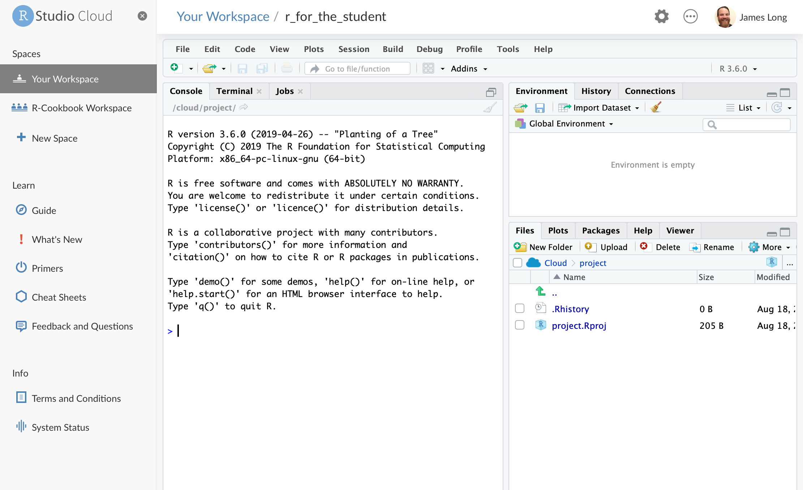

```{r setup, include=FALSE}
knitr::opts_chunk$set(echo = TRUE)
```


## Abstract

## Introduction - Dusty

The Father of Modern Econometrics, Adam Smith, once frustratingly stated:

> The discipline of colleges and universities is in general contrived, not for the benefit of the students, but for the... ease of the masters. [@smith]

<!-- > The discipline of colleges and universities is in general contrived, not for the benefit of the students, but for the interest, or more properly speaking, for the ease of the masters. -->

<!-- https://www.adamsmith.org/adam-smith-quotes -->
<!-- This article is in the lit review folder -->

Adam Smith is making the claim that methods of instruction used by professors are those which are easiest for the instructor, but not necessarily what is best for the student.  This is understandable, as research and other administive demands force instructors to rely on tried teaching techniques which are familiar to the teacher and not what will equip the student to be most successful in their career.

The authors of this article will make the case that the R open sourse statistical programming languge can bridge this gap between a Smith's proverbial teacher's ease and a student's benefit.  As R continues to be one of the more popular coding languages in industry with ever increasing technical support, the barriar for entry keeps falling.  There are many tools available in R which can aide the teaching process to get students loading and exploring data quickly requiring low overhead for proficiency to teach.  With ample open source support, a wide acceptance in industry and many additional features to explore and present data, teaching with R both satisfies the ease for the instructor and has long term benefit for the students.  

This is something we are certain Adam Smith would be proud of.

<!-- Motivation to learn/teach r / Purpose of paper -->
<!-- Good thing is that there are all these addons -->

I think we need to explain the difference between R & RStudio right in the intro. 

## The R Ecosystem

The advantages to using R whether in an academic setting or industry are myriad. Since R and RStudio IDE are both open source they have no financial costs to adoption. In addition, R has a very rich ecosystem of addon packages that expand R and add functionality to both R and the RStudio environment. These packages add features ranging from libraries to connect to commercial database systems to implementation of new machine learning algorithms. 

### CRAN 

The online home of R is the Comprehensive R SOMETHING Network, CRAN. CRAN is where a new user can download R and access packages that expand the functionality of R. As of the August 2019 there are XXXX R packages hosted on CRAN for free download. Some new users to R are overwhelmed by the volume of packages. To help make sense of the CRAN ecosystem, CRAN has published CRAN Task Views which organize popular packages into categories of use (e.g. econometrics or spatial statistics). The task views are written and maintained by a subject matter expert. There are more than 35 such task views which can help new R users make sense of the packages availiable in their areas of interest and know which packages are recommended by an expert in their domain of interest. 

### RStudio

When R is downloaded from CRAN, it comes with an engine for executing R code along with a few core packages for doing statistical analysis and graphics. Collectivly these tools are refered to as "Base R". Base R comes with a basic text editor for editing and executing R scprits. However most users quickly discover that writing R code is easier wiht an indtegrated developemnt environment (IDE). The most popular IDE for R is RStudio whcih we highly recommend for teaching.

RStudio desktop can be downloaded for free from RStudio.com. In additon to the desktop IDE, RStudio makes a server based IDE for using R on remote machines. RStudio server also is availiable in a professional version that offers more features such as authentication and collaborative editing. RStudio offers its professional tools to academics for free. Go to http://XXXXXX for more info. 

For many instructors, the freely availiable RStudio.cloud service (http://rstudio.cloud) greatly simplifies instruction by providing a fully functional and configured R and RStudio environment running on cloud hosted hardware. For the rest of this article we will exclusivly use RStudio.cloud in our examples. Instructors can set up projects in RStudio.cloud and share those projects with students to simplify distributing cource material.

```{r icons, fig.cap='RStudio.cloud', echo=FALSE, eval=TRUE}

```

Instructors who don't want to use the cloud solutions, or can't because of connectivity restrictions can also download and install R and RStudio on local hardware. For details on downloading and installing, see section XXX in R Cookbook Second Edition, available online at http://rcse.com/xxxx 

### Projects

RStudio introduces a powerful organizational tool called an RStudio Project.  Projects help you by doing the following:

-  Storing RStudio project settings
-  Restoring window position in RStudio so when you return to a project you can pick up exactly where you left off
-  Setting the working directory 

RStudio creates a project file with an *.Rproj* extension in the project directory. RStudio also creates a hidden directory, *.Rproj.user*, for temporary files related to your projec

We've found that helping students organieze their files using projects from the start helps them build good practices and prevent lost files and file path related issues that can flummox new learners. 

### Tidyverse

In addition to the RStudio IDE, the RStudio company supports the development of a number of open source packages designed to work together to make R easier to use and faster to learn. These libraries are collectivly known as the "Tidyverse". The most concise definition of the Tidyverse comes directly from its originator and core maintainer, Hadley Wickham:

> The tidyverse is a set of packages that work in harmony because they share 
> common data representations and API design. The tidyverse package is designed 
> to make it easy to install and load core packages from the tidyverse in a 
> single command. The best place to learn about all the packages in the 
> tidyverse and how they fit together is *[R for Data Science](http://r4ds.had.co.nz)*.

(https://blog.rstudio.com/2016/09/15/tidyverse-1-0-0/)

The authors have had very good experiences with introducing laerners to the Tidyverse from the very beginning of the learning journey because these tools help learners see very quick successes which, in turn, keeps them engaged in the learning process. The popular plotting package `ggplot2` and the data manipulation package `dplyr` are both core Tidyverse packages. 

The Tidyverse meta-package, like any CRAN package, can be installed from the R Console:

```{r eval=FALSE, include=TRUE}
install.packages("tidyverse")
```

***screen shot of install ***

#### Tidyverse Packages
When a user installs the Tidyverse, as illustrated above, 19 packages are installed. Then when the user loads the tidyverse using `library(tidyverse)` a core subset of 8 packages are loaded into R. To use any of the pacakges not loaded with the core Tidyverse a user must explicitly load those packages (e.g. `library(readxl)`) or call the packages using the package name prefix (e.g. `readxl::read_xlsx()` to run the `read_xlsx()` function from the `readxl` package).

The packages listed below are in the "Core Tidyverse" and get loaded with `library(tidyverse)` and which must be called individually even though they are installed withe the Tidyverse meta-package. 

***Core Tidyverse***

`ggplot2`: data visualisation
`dplyr`: data manipulation
`tidyr`: data reshaping
`readr`: data import
`purrr`: functional programming
`tibble`: tidy dataframes
`stringr`: string manipulation
`forcats`: factor use

***Additional Tidyverse***

There are 11 additional Tidyverse packages that get installed, but not automatically loaded. These add specialized functions for more specialized uses.

Date and time manipulation:

`hms` & `lubridate`

Model building and output manipulation:
`modelr` & `broom`

Data inport:
`feather`, `haven`, `httr`, `jsonlite`, `readxl`, `rvest`, and `ml2`

More info on each can be found at https://tidyverse.tidyverse.org


## Tutorial begins - Dusty will start


### Loading Data (Gapminder)

```{r message=FALSE, warning=FALSE}
library(tidyverse)
gapminder <- read_csv("01_data/gapminder.csv")
```
Or directly from a URL:
will be a 404 until the repo is public

```{r eval=FALSE, message=FALSE, warning=FALSE, include=FALSE}
gapminder <- read_csv("https://github.com/CerebralMastication/r_for_the_student/blob/master/01_data/gapminder.csv")
```

A third option would be to download the gapminder data from the website listed above then refrence the location from the location on your computer.

```{r eval=FALSE, message=FALSE, warning=FALSE, include=FALSE}
gapminder <- read_csv("/file/path/to/your/document/gapminder.csv")
```

### Identifying data types

When reading in data, the `read_csv` command does the best it can to identify the datatype of each column of data.  

Simply outputting the code can tell us a bundle of information about the data we have just loaded.  Lets look at the output below.

```{r eval=TRUE, message=FALSE, warning=FALSE,include=TRUE}
gapminder
```

From the output below, the `gapminder` dataset is a `tibble` consisting of 1,704 observational units with 6 columns of information.  The data type of each colum is listed below the column name.  We can see that we have a mix of `character`s and `double`s.  

<!-- May need to flesh out what a tibble/doube are.  Do you think we should have a definitions section at the end? -->

You'll also notice that printing out the data does not tell you all the information you'd like to know.  You'll realize that your data has information about countries, but are they all Afghanistan?  Likely no, as you can see there are 1,694 more rows and they probably are not all Afghanistan.  Lets look at other ways to understand your data. 

```{r, warning=FALSE}
summary(gapminder)
```

You can see that this output gives us more information.  For all `numeric` columns, R tells us the range of the data with breaks at each quarters.  However, we are still left wanting.

We recommend using the `skim` command from the `skimr` library.  You may need to download the `skimr` package from CRAN.

```{r eval=FALSE, message=FALSE, warning=FALSE, include=TRUE}
install.packages("skimr")
```

```{r, warning=FALSE}
library(skimr)
skim(gapminder)
```

This gives us a much better view of the data.  `skim` breaks the data apart by variable type giving us important information for each data type.  

For each class of data (`character`/`numeric`), `skim` tells us how many missing , complete, and total (n) observations for each column.

For the character class `skim` provides additional information about each column.  This includes the min/max length of each character string as well as the number of unique (n_unique) observations.  

For the numeric class, `skim` provides mean, standard deviation (sd), and percentile breaks (p0, p25,...,p100).  It also provides a small histogram to help visualize the distribution of your numeric data (hist).

This likely does not satisfy the user's desire to understand the data as we still do not understand which counties are in the data among other curiosities.  We will provide more indepth methods of understanding your data in the Exploratory Data Analysis (EDA) section of this paper.   

### `dplyr` Verbs 

Almost any time a user is working with data, they will need to manipulate that data in some way.  In this next section, we will introduce the main 6 `dplyr` verbs to help wrangle data to gain additional insight.  These verbs, `select`, `filter`, `mutate`, `group_by`, `summarize`, `arrange` are explained in detail below.  

In order to motivate use of the aformentioned verbs, we'll look to answer the following question

#### `select`

mention reshape?? or pivot/unpivot which i guess is the new hotness. 

### Plotting/EDA

Typically before building any models or doing other analysis, students benefit from learning to do basic exploritory data analysis (EDA). One tool for quickly getting students a quick win with learning data visualization with `ggplot` is to use the package `esquisse` to give them a graphical user interface that helps them write `ggplot` code. 

Since `esquisse` is a CRAN package, it can be installed by running `install.packages("esquisse")`. After installation, `esquisse` shows up in the *Addins* menu of RStudio:

****screen shot of add in menu****

The `'ggplot2' builder` menu option opens the graphical interface for building `ggplot2` graphics using a helper UI. Below is how the `esquisse` interface appears with the `gapminder` data selected:

****esquisse screen shot****

The strength of `esquisse` is that it produces the `ggplot2` code that allows the R learner to see how they can build the syntax themselves in the future. This gives students an increadible learning boost that reduces the likelyhood that they will get stuck when trying to make their first `ggplot2` figures. For more information about `esquisse` see the project CRAN web site: https://cran.r-project.org/web/packages/esquisse/readme/README.html


### Regression 
**JD Note:** so I was taught regression analsis using $X'X^-1 (X'Y)$ and doing the matrix calculations. Worth mentioning? I'm not inclined but thought I'd mention it. 

parsnip/tidymodels


### text from prior draft left below for salvaging

## An example of how to cite in R


With more than 275 practical recipes, this expanded edition [@teetor_long] helps you perform data analysis with R quickly and efficiently. The R language [@R-rmarkdown;@R-knitr] provides everything you need to do statistical work, but its structure can be difficult to master. These task-oriented recipes make you productive with R immediately. Solutions range from basic tasks to input and output, general statistics, graphics, and linear regression.

Each recipe addresses a specific problem and includes a discussion that explains the solution and provides insight into how it works. If you're a beginner, R Cookbook will help get you started. If you're an intermediate user, this book will jog your memory and expand your horizons @grolemund_wickham. You'll get the job done faster and learn more about R in the process.


#### R Studio Layout

One of the most common mistakes I run into in class on day one is for beginners to try to run R directly from the console.  They have R Studio downloaded, but do not understand the difference between R and R studio.  R is the program that executes all commands you provide.  It is the engine of the car, if you will.  R Studio is the shell that keeps the user organized.  R Studio is the shell around the car.  To continue, it is the steering wheel, accelerator, brakes, and seatbelts.  

To ensure you have opened R Studio, you screen should be broken into 3 to 4 panels.  

1) Top Right: The Environment
2) Bottom Right: The Files Viewer (what do you call this quadrants?)
3) Bottom Right: The Console
4) Top Left: The Script

Upon first opening R Studio, you may not have panel 4.  In order to open up a script, you will need to select `file` -> `New File` -> `R Script`.

Many new users also make the mistke of not realizing that they have not opened up a script.  They begin executing in the console again and do not take advantage of the ease that scripts provide in writing reproducable code.  

Possibly note on how to execute lines of code.  Both code chuncks and specific lines of code. 

### Tidyverse 

## Installation

paraphrase what's in R Cookbook?

### Installing R

### Installing R Studio

### Installing the Tidyverse

## Using R

### Loading Data

### Plotting 

quick intro to ggplot

That graphical tool for ggplot?


### Plotting Multivariate Data

ggpairs?


<!-- When teaching, is the intent to teach coding in R, or is it to use R as an aide to teach statistics?  This will drive what you do and why you do it.   -->

<!-- ### What is the intent of teaching with R? -->

<!-- I have taught advanced introduction to probability and statistics and used R as a tool to teach statistics.  We introduced it by showing how it can be a good calculator -- and along the way taught some of the R Studio functionality (projects/setting working directory, how to execute lines of code, save variables, etc). -->

<!-- I have also taught sabermetrics where we taught coding in R.  So we needed to do data analysis (and we worked under the assumptions that our cadets knew basic statistics) so I taught the coding as a means of data analysis. -->

<!-- ### Do you "give stutents code"? -->

<!-- You have two options:  -->

<!-- 1) Give students code before class.   -->

<!-- The advantage here is that you can talk concepts and the syntax and inevitable mistyping, etc does not inhibit the larger purpose of the instruction.   -->

<!-- The disadvantage is that students don't get intimate with the coding process and learn the necessary skill of trial and error.   -->

<!-- 2) Don't give them code and expect them to keep up.   -->

<!-- The advantage is that cadets are learning the process of coding and "own" the code while they write it.   -->

<!-- The disadvantage is instead of teaching concepts, students are distracted by keeping up with the coding and missing out on the statistics lesson -->

<!-- My recommendation -- you give code if your intent is teaching statistics.  You don't give code if the intent is that cadets learn to code.   -->


# Bibliography

<!-- @grolemund_wickham -->
<!-- @long_teetor -->
<!-- @R-knitr -->
<!-- @R-rmarkdown -->