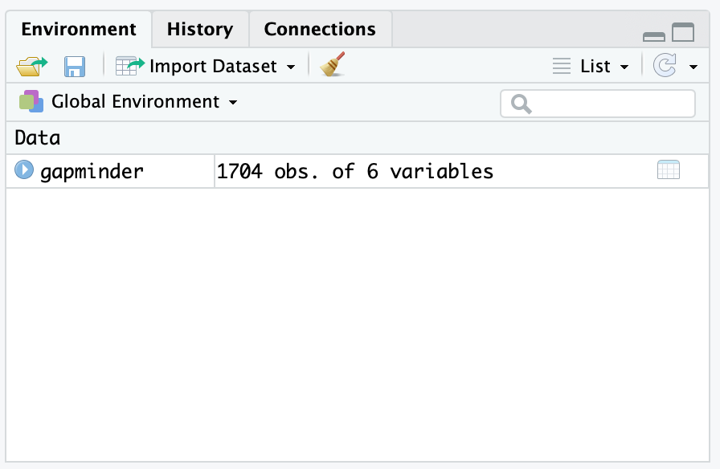

```{r setup, include=FALSE}
knitr::opts_chunk$set(echo = TRUE)
options(scipen = 999)
```


## Abstract

## Introduction

The Father of Modern Econometrics, Adam Smith, once frustratingly stated:

> The discipline of colleges and universities is in general contrived, not for the benefit of the students, but for the... ease of the masters. [@smith]

<!-- > The discipline of colleges and universities is in general contrived, not for the benefit of the students, but for the interest, or more properly speaking, for the ease of the masters. -->

<!-- https://www.adamsmith.org/adam-smith-quotes -->
<!-- This article is in the lit review folder -->

Adam Smith is making the claim that methods of instruction used by professors are those which are easiest for the instructor, but not necessarily what is best for the student.  This is understandable, as research and other administive demands force instructors to rely on tried teaching techniques which are familiar to the teacher and not what will equip the student to be most successful in their career.

The authors of this article will make the case that the R open sourse statistical programming languge can bridge this gap between a Smith's proverbial teacher's ease and a student's benefit.  As R continues to be one of the more popular coding languages for statistical analysis with ever increasing technical support, the barriar for entry keeps falling.  There are many tools available in R which can aide the teaching process to get students loading and exploring data quickly with manageable overhead for the instructor.  With ample open source support, a wide acceptance in industry, and many additional features to explore and present data, teaching with R both satisfies the ease for the instructor and has long term benefit for the students.  

<!-- do you think it would be benificial to show some sort of graphic of r growth over time? if you think it worth it, I can pull data from stack overflow of r tag increases over time. -->

This is something we are certain Adam Smith would be proud of.

## The R Ecosystem

The advantages to using R whether in an academic setting or industry are myriad. Since R and all the tooling we discuss below are open source, they have no financial costs to adoption. In addition, R has a very rich ecosystem of add-on packages that expand R and add functionality. These packages add features ranging from libraries to connect to commercial database systems to implementation of new machine learning algorithms. 

### CRAN 

The online home of R is the Comprehensive R Archive Network, CRAN. CRAN is where a new user can download R and access packages that expand the functionality of R. There are currently more than 10,000 R packages hosted on CRAN for free download. Some new users to R are overwhelmed by the sheer volume of packages. To help make sense of the CRAN ecosystem, CRAN has published CRAN Task Views which organize popular packages into categories of use (e.g. econometrics or spatial statistics). The task views are written and maintained by a subject matter expert. There are more than 35 such task views which can help new R users make sense of the packages availiable in their areas of interest and know which packages are recommended by an expert in their domain of interest. This can give instructors and students a curated view into packages that might match their interests or field of study: https://cran.r-project.org/web/views/

### RStudio

When R is downloaded from CRAN, it comes with an engine for executing R code along with a few core packages for doing statistical analysis and graphics. Collectivly these tools are refered to as "Base R". Base R comes with a basic text editor for editing and executing R scprits. However most users quickly discover that writing R code is easier wiht an integrated developemnt environment (IDE). The most popular IDE for R is RStudio whcih we highly recommend for teaching.

RStudio desktop can be downloaded for free from RStudio.com. In additon to the desktop IDE, RStudio makes a server based IDE for using R on remote machines. RStudio server also is availiable in a professional version that offers more features such as authentication and collaborative editing. RStudio offers its professional tools to academics for free. Go to https://www.rstudio.com/pricing/academic-pricing/ for more info. 

For many instructors, the freely availiable RStudio.cloud service (http://rstudio.cloud) greatly simplifies instruction by providing a fully functional and configured R and RStudio environment running on cloud hosted hardware. For the rest of this article we will exclusivly use RStudio.cloud in our examples. Instructors can set up projects in RStudio.cloud and share those projects with students to simplify distributing course material.

```{r icons, fig.cap='RStudio.cloud', echo=FALSE, eval=TRUE}

```

Instructors who don't want to use the cloud solutions, or can't because of connectivity restrictions, can download and install R and RStudio on local hardware. For details on downloading and installing, see section 1.1 in R Cookbook Second Edition, available online at https://rc2e.com/gettingstarted#recipe-id001.

### Projects

RStudio introduces a powerful organizational tool called an RStudio Project.  Projects help you by doing the following:

-  Storing RStudio project settings
-  Restoring window position in RStudio so when you return to a project you can pick up exactly where you left off
-  Setting the working directory 

RStudio creates a project file with an *.Rproj* extension in the project directory. RStudio also creates a hidden directory, *.Rproj.user*, for temporary files related to your project.

We've found that helping students organieze their files using projects from the start helps them build good practices and prevent lost files and file path related issues that can flummox new learners. Although instructors should expect to teach the basics of absolute and relative file paths, as this concept is sometimes new to learners and can slow learning. 

### Tidyverse

In addition to the RStudio IDE, the RStudio company supports the development of a number of open source packages designed to work together to make R easier to use and faster to learn. These libraries are collectivly known as the "Tidyverse". The most concise definition of the Tidyverse comes directly from its originator and core maintainer, Hadley Wickham:

> The tidyverse is a set of packages that work in harmony because they share 
> common data representations and API design. The tidyverse package is designed 
> to make it easy to install and load core packages from the tidyverse in a 
> single command. The best place to learn about all the packages in the 
> tidyverse and how they fit together is *[R for Data Science](http://r4ds.had.co.nz)*.

(https://blog.rstudio.com/2016/09/15/tidyverse-1-0-0/)

The authors have had very good experiences with introducing learners to the Tidyverse from the very beginning of the learning journey because these tools help learners see very quick successes which, in turn, keeps them engaged in the learning process. The popular plotting package `ggplot2` and the data manipulation package `dplyr` are both core Tidyverse packages. 

The Tidyverse meta-package, like any CRAN package, can be installed from the R Console:

```{r eval=FALSE, include=TRUE}
install.packages("tidyverse")
```

#### Tidyverse Packages
When a user installs the Tidyverse, 19 packages are installed. Then when the user loads the tidyverse using `library(tidyverse)` a core subset of 8 packages are loaded into R. To use any of the pacakges not loaded with the core Tidyverse a user must explicitly load those packages (e.g. `library(readxl)`) or call the packages using the package name prefix (e.g. `readxl::read_xlsx()` to run the `read_xlsx()` function from the `readxl` package).

The packages listed below are in the "Core Tidyverse" and get loaded with `library(tidyverse)`. 

***Core Tidyverse***

`ggplot2`: data visualisation  
`dplyr`: data manipulation  
`tidyr`: data reshaping  
`readr`: data import  
`purrr`: functional programming  
`tibble`: tidy dataframes  
`stringr`: string manipulation  
`forcats`: factor use  

***Additional Tidyverse***

There are 11 additional Tidyverse packages that get installed, but not automatically loaded. These add specialized functions for more specialized uses.

`hms`: time manipulation
`lubridate`: date manipulation  
`modelr`: model building  
`broom`: output manipulation  
`feather`: reading / writing data
`haven`: reading / writing data
`httr`: accessing html
`jsonlite`: JSON manipulation
`readxl`: reading Excel files
`rvest`: scrape html data
`xml2`: Data inport  

More info on each can be found at https://tidyverse.tidyverse.org

## Harnessing The Power of R and the Tidyverse 

In the following sections, we will highlight some of the features of R and the `tidyverse` and how they can be useful in a classroom setting while teaching new students.  

### Loading Data (Gapminder)

To aide our instructions, we will explore the Gapminder data set.  The Gapminder dataset is created by the Gapminder Foundation which is a non-profit which promots sustainable global development.  https://www.gapminder.org

Showing students how to load in example data is a crucial first step. Data can be easily loaded from the local file system:

```{r message=FALSE, warning=FALSE}
library(tidyverse)
gapminder <- read_csv("01_data/gapminder.csv")
```

Or directly from a URL:
<!-- will be a 404 until the repo is public -->

```{r eval=FALSE, message=FALSE, warning=FALSE, include=FALSE}
gapminder <- read_csv("https://github.com/CerebralMastication/r_for_the_student/blob/master/01_data/gapminder.csv")
```

Once the student reads the the data into R, the environment tab in the top right of the computer will reflect that the data is loaded.  

```{r icons2, fig.cap='Environment With Gapminder Data', echo=FALSE, eval=TRUE}

```

### Initial Data Exploration

Simply outputting the code can tell students a bundle of information about the data just loaded.  Lets look at the output below.

```{r eval=TRUE, message=FALSE, warning=FALSE,include=TRUE}
gapminder
```

From the output above, one can see the `gapminder` dataset is a `tibble` consisting of 1,704 observational units with 6 columns of information. When reading in data, the `read_csv` command identifies the most likely class of data for each column lists the class below the column name.  We can see that we have a mix of `character`s and `double`s. A `tibble` is a Tidyverse take on R's traditional `data.frame`. We've found that it usually is sufficient to tell students that `tibble` is a table. Since the goal is to get students using data to *do* things we often don't spend excessive time on definitions and instead focus on getting students doing something interesting. 

Students also notice that printing out the data does not provude all the information they would like to know.  One can see that the data has information about countries, but are they all Afghanistan?  Likely no, as you can see there are 1,694 more rows and they probably are not all Afghanistan.  Lets look at other ways to understand the data. 

We recommend using the `skim` command from the `skimr` library.  You may need to download the `skimr` package from CRAN.

```{r eval=FALSE, message=FALSE, warning=FALSE, include=TRUE}
install.packages("skimr")
```

<!-- What is your hack to make the histograms print out correctly? -->

```{r, warning=FALSE, message=FALSE}
library(skimr)
skim(gapminder)
```

This gives students a much better view of the data.  `skim` seperates the data by class and provides important information for each data type.  We find that the `skim` function gives students the quickest and best description of the data.  Other options of presenting detailed information about the data include the `summary(gapminder)`, `glimse(gapminder)`, and `str(gapminder)`

In the output above, for each class of data (`character`/`numeric`), `skim` provides how many missing, complete, and total (n) observations for each column.

For the character class, `skim` provides additional information about each column.  This includes the min/max length of each character string as well as the number of unique (n_unique) observations.  

For the numeric class, `skim` provides mean, standard deviation (sd), and percentile breaks (p0, p25,...,p100).  It also provides a small histogram to help visualize the distribution of your numeric data (hist).

This likely does not satisfy the students's desire to understand the data as we still do not understand which countries are in the data among other curiosities.  We will provide more indepth methods of understanding the data in the plotting and Exploratory Data Analysis (EDA) section after we look briefly at the 6 `dplyr` verbs that allow students to begin rapidly understanding the data.   

### `dplyr` Verbs

Almost any time a student wors with data, they will need to manipulate that data in some way.  In this next section, we will introduce the main 6 `dplyr` verbs to help wrangle data to gain additional insight.  These verbs, `select`, `filter`, `mutate`, `group_by`, `summarize`, `arrange` are explained in detail below.  

In order to motivate a student's use of the aformentioned verbs, we'll look to answer the following question: 

<!-- for PDF output -->
<!-- \begin{center} -->
<!-- \textbf{What is the average GDP per country since 1980?} -->
<!-- \end{center} -->

<!-- for html output -->
<center>
**What is the average GDP per country since 1980?**
</center>

#### Verb 1: `select`

To begin, we only need to work with certain columns.  The relevent columns to this question are `country`, `year`, `pop`, and `gdpPercap`.  We can make this selection using the `select` function.  The first argument in the `select` function is the data we which to select from.  The subsequent arguments are the names of the columns from the data we wish to select.  In the code below, we save our selected columns into a new tibble called `gapminder_selected`.

```{r}
gapminder_selected = select(gapminder, country, year, pop, gdpPercap)
gapminder_selected
```

Once we view the data, we see that we now have 1704 rows with 4 columns.  

#### Verb 2: `filter`

To further answer our question, we need to filter our data down to the years of interest.  We can achieve this goal using the `filter` function.  Like the `select` function, the first argument in the `filter` function is the data and subsequent argument is the logical statement of which you wish to filter.  In the code below, we filter our selected data and save our filtered data into a new tibble called `gapminder_filtered`.

```{r}
gapminder_filtered = filter(gapminder_selected, year >= 1980)
gapminder_filtered
```

Once we view the data, we see that our data now consist of years since 1980.

#### Verb 3: `mutate`

The next step in answering our question is creating a column that contains the information of interest.  The `mutate` function creats new columns according to a specific function that we provide.  To answer our question, we need to determine the GDP in each year.  To find the GDP, we need to multiply the `gdpPercap` by the `pop`.  Similar to the previous two verbs, the first argument in the `mutate` function is the data.  Subsequent arguments are columns you wish to create with corresponding formulas.  In the code below, we mutate our filtered data and save our mutated data into a new tibble called `gapminder_mutated`.

```{r}
gapminder_mutated = mutate(gapminder_filtered, GDP = gdpPercap * pop)
gapminder_mutated
```

Once we view the data, we see the new column, GDP, has been added to the end of our tibble.  

#### Verb 4: `group_by`

The next step in answering our question will be to group our data by the topic of interest.  In this instance, since we want to know GDP by country, we need to group or data by country.  A way to conceptualize this step is to think of placing each group of data into a specific room.  In subsequent steps we will apply a function to each group (or room) of data.  Just like the previous verbs, the first argument in the `group_by` function is the data.  The following arguments are the columns you wish to group by.  In the code below, we group our mutated data and save our grouped data into a new tibble called `gapminder_grouped`.

```{r}
gapminder_grouped =  group_by(gapminder_mutated, country) 
gapminder_grouped
```

The reader will notice that there apears to be no change to the data.  This is mostly true as we have simply told R that we would like to apply future functions over each group of data instead of over the entire tibble.  The only difference in output is the a note explaining the what the data has been grouped into and the number of groups.  In this case, it explains the data is grouped by `country` and that there are 142 groups.  

#### Verb 5: `summarise`

Next, in order to determine the average GDP by country, we need to apply a function to each group we have identified.  In this instance, we will need to take the average GDP over each continent.  Since we've already grouped by country, we simply need to apply the summarise function.  Like the previous verbs, the first argument in the `summarise` function is the data.  The following arguments are the function you would like to apply to each group.  In the code below, we summarise our grouped data and save our summarised data into a new tibble called `gapminder_summarised`.

```{r}
gapminder_summarised = summarise(gapminder_grouped, AVG_GDP = mean(GDP))
gapminder_summarised
```

We now have an answer to our question.  The tibble above shows the average GDP per country since 1980.  

#### Verb 6: `arrange`

However, we can refine our data to provide more understanding.  Currently, our data is sorted alphabetically by country.  This does not provide much insight.  We can use the `arrange` function to sort the data by average GDP; both assending and descending.  Like all other verbs, the first argument in the `arrange` function is the data.  The following argument is the column you wish to sort by.  In the code below, we arrange our summarised data and save our arranged data into a new tibble called `gapminder_arranged`.

```{r}
gapminder_arragned = arrange(gapminder_summarised, AVG_GDP)
gapminder_arragned
```

We see, from the output above, the countries with the smalled average GDP since 1980.  

It may be more interesting, however, to sort the average GDP in descending order so we can learn the countries with the highest average GDP.  To do this we simply place a `-` sign in front of `AVG_GDP` in the call above.  

```{r}
gapminder_arragned_descending = arrange(gapminder_summarised, -AVG_GDP)
gapminder_arragned_descending
```

#### Simplifying Code with the Pipe Operator: `%>%` 

After helping learners see how each function works we can introduce the pipe operator (`%>%`) that can be used to chain together commands and pass the results of one functiopn directly into the next function. This can result in very logical data manipulation steps that are easy to learn and easy to understand:

```{r pipechain}
gapminder_arragned_descending_chained =
  gapminder %>%
  select(country, year, pop, gdpPercap) %>%
  filter(year >= 1980) %>%
  mutate(GDP = gdpPercap * pop) %>%
  group_by(country) %>%
  summarise(AVG_GDP = mean(GDP)) %>%
  arrange(-AVG_GDP)

gapminder_arragned_descending_chained
```

<!-- Does the next paragraph help the explaination or is it just more verbose blabbing... -->

Some students may struggle to grasp this coding technique.  It may be helpful to explain the pipe in the following way:  A pipe takes the result of the previous fuction and 'pipes' it into the first argument of the next function.  In that way, we can chain together our verbs to manipulate and gain insight on the data.

### Plotting/EDA

From the preceeding example, you can see how to gain insight from data by manipulating the tibble with `dplyr` verbs. A more helpful way to gain insight from data is by viewing it graphically.  We'll go over plotting basics 

Typically before building any models or doing other analysis, students benefit from learning to do basic exploritory data analysis (EDA). One tool for getting students a quick win with learning data visualization is to use `ggplot2` with the helper package `esquisse` to give them a graphical user interface that helps them write `ggplot2` code. 

Since `esquisse` is a CRAN package, it can be installed by running `install.packages("esquisse")`. After installation, `esquisse` shows up in the *Addins* menu of RStudio:

```{r addins, fig.cap='Addins menue', echo=FALSE, eval=TRUE}

```

The `'ggplot2' builder` menu option opens the graphical interface for building `ggplot2` graphics using a helper UI. Below is how the `esquisse` interface appears with the `gapminder` data selected:

```{r esquisse, fig.cap='esquisse UI', echo=FALSE, eval=TRUE}

```

The strength of `esquisse` is that it produces the `ggplot2` code that allows the R learner to see how they can build the syntax themselves in the future. This gives students an increadible learning boost that reduces the likelyhood that they will get stuck when trying to make their first `ggplot2` figures. For more information about `esquisse` see the project CRAN web site: https://cran.r-project.org/web/packages/esquisse/readme/README.html


### Regression 

One of the more common statistical tools students learn in Econometrics is Linear Regression.  It happens to be one of many tools in R's arsonel.

In the base stats package and with one additional library, R offers easy to execute and simple to understand tools to execute everything we would expect a student to learn in linear regression.  

To highlight these tool, lets explore the linear relationship between several variables and life expectancy (`lifeExp`) in the Gapminder data.

#### Simple Linear Regression

To execute linear regression, we need to specify two arguments in the `lm` function: The formula and the data.  As you can see in the example below, our formula is in the format `y~x` - pronounced y by x.  As expected, the `data` is equal to `gapminder`.

```{r}
model1 = lm(formula = lifeExp ~ gdpPercap, data = gapminder)
```

R executes this command and saves it as `model1`.  To retrieve our simple linear regression model, we place `model1` in the summary command below.

```{r}
summary(model1)
```

As you can see from the output, the student sees pertinent information about the model to include the equation, a small summary of the residuals, regression coefficients, P Values, and familiar model evaluation statistics such as $R^2$ and Adjusted $R^2$.  

Adjusting the linear model is simple.  Should we desire to add another factor to the model, we can do it simply by adding it to the formula like the example below.

```{r}
model2 = lm(formula = lifeExp ~ gdpPercap + year, data = gapminder)
summary(model2)
```

Lastly, R's linear model function is flexible enought to easily add interaction terms.  Teaching using this syntax is a simple and easy to demonstrate.

```{r}
model3 = lm(formula = lifeExp ~ gdpPercap * year, data = gapminder)
summary(model3)
```

#### Linear Regression Modeling Assumptions

One of the staples of teaching linear regression is helping students determine if their model meets the four assumptions necessary for a linear model to be valid:

1) Independent Observations
2) Normal Errors
3) Consistant Variance
4) Linear Relationships

Independent Observations: 

To determine independence, we must know how the data was collected.  There are likely independence issues as the data on each country in the Gapminder collection are likely influenced by each other.  We'll acknowledge this and proceed on with the analysis.  

Other Assumptions:

To verify the other assumptions, we need to create two plots.  The residual plots and a qqplot.

To create the residual plots, we'll explore model 2.  We need to create three plots.  The y axes for each plot will be the residuals (the observed life expectancy - the life expectancy predicted by our model).  The x axis for our three plots will be GDP Per Capita, year, and our predicted values.  

We will need to crete the residuals to execute these plots.  We can do this as the code below specifies.

```{r}
predictions = predict.lm(object = model2, newdata = gapminder)
```

We can easily add these predictions to our tibble for plotting with the tools we've previously learned.  Furthermore, we can calculate the redisuals in the next step.

```{r}
gapminder_predicted = gapminder %>%
  mutate(Fitted = predictions) %>%
  mutate(residual = lifeExp - predictions)
head(gapminder_predicted)
```

Now we can use `ggplot` to create the three residual plots.

```{r}
gapminder_predicted %>%
  ggplot(aes(x = gdpPercap, y = residual)) +
  geom_point() +
  geom_hline(aes(yintercept = 0, color = "red"),
             linetype = "dotdash",
             size = 1) +
  labs(x = "GDP Per Capita", y = "Residual", title = "Residual Plot (GDP Per Capita vs Residual)") +
  theme(legend.position = "none")
gapminder_predicted %>%
  ggplot(aes(x = year, y = residual)) +
  geom_point() +
  geom_hline(aes(yintercept = 0, color = "red"),
             linetype = "dotdash",
             size = 1) +
  labs(x = "Year", y = "Residual", title = "Residual Plot (GDP Per Capita vs Year)") +
  theme(legend.position = "none")
gapminder_predicted %>%
  ggplot(aes(x = Fitted, y = residual)) +
  geom_point() +
  geom_hline(aes(yintercept = 0, color = "red"),
             linetype = "dotdash",
             size = 1) +
  labs(x = "Fitted Values", y = "Residual", title = "Residual Plot (Fitted Values vs Residual)") +
  theme(legend.position = "none")
```

<!-- I could also do this and explain it, but is this too much? -->

```{r}
gapminder_predicted %>%
  mutate(Predictions = Fitted) %>%
  # mutate(year = as.factor(year)) %>%
  gather(XAxis, Value, year, gdpPercap, Fitted) %>%
  ggplot(aes(x = Value, y = residual)) +
  geom_point() +
  facet_wrap(~ forcats::fct_relevel(XAxis, "gdpPercap", "year", "Fitted"),
             scales = "free_x") +
  geom_hline(aes(yintercept = 0, color = "red"),
             linetype = "dotdash",
             size = 1) +
  labs(x = "X Values", "Residuals", "Residual Plots") +
  theme(legend.position = "none")
```

The second plot we need to look at is the qqplot.

```{r}
gapminder_predicted %>%
  ggplot(aes(sample = residual)) +
  stat_qq() +
  stat_qq_line()
```


We can see from the residual plots, that our model stands up well to consistant variance, however, linearity and normality of errors are suspect.  Lets apply a simple transformation to our model and see if it improves our residuals.


```{r}
modeladj = lm(formula = lifeExp ~ log(gdpPercap) + year, data = gapminder)
summary(modeladj)
```

We'll now re-run the same code as before and look at the change to our residuals to see how our change impacts our assumptions.

```{r}
predictions = predict.lm(object = modeladj, newdata = gapminder)

gapminder_predicted = gapminder %>%
  mutate(Fitted = predictions) %>%
  mutate(residual = lifeExp - predictions)

gapminder_predicted %>%
  ggplot(aes(x = gdpPercap, y = residual)) +
  geom_point() +
  geom_hline(aes(yintercept = 0, color = "red"),
             linetype = "dotdash",
             size = 1) +
  labs(x = "GDP Per Capita", y = "Residual", title = "Residual Plot (GDP Per Capita vs Residual)") +
  theme(legend.position = "none")
gapminder_predicted %>%
  ggplot(aes(x = year, y = residual)) +
  geom_point() +
  geom_hline(aes(yintercept = 0, color = "red"),
             linetype = "dotdash",
             size = 1) +
  labs(x = "Year", y = "Residual", title = "Residual Plot (GDP Per Capita vs Year)") +
  theme(legend.position = "none")
gapminder_predicted %>%
  ggplot(aes(x = Fitted, y = residual)) +
  geom_point() +
  geom_hline(aes(yintercept = 0, color = "red"),
             linetype = "dotdash",
             size = 1) +
  labs(x = "Fitted Values", y = "Residual", title = "Residual Plot (Fitted Values vs Residual)") +
  theme(legend.position = "none")
gapminder_predicted %>%
  ggplot(aes(sample = residual)) +
  stat_qq() +
  stat_qq_line()
```

It appears that the consistancy of variance assumption is satisfied, however, the normality of errors is still a little suspect.

### Conclusion

R is awesome! You should teach with it for several reasons:

Free, easily accessable (unless you are on a government network), reproducable, relativly easy...


### Overarching questions:

1) Does the introduction do what we want it to do?
2) Does the tutorial piece speak correctly?  Meaning, should it be more like, "we find students benefit from this:" vs what it is currently: "Here, let me teach you the following"
3) Should we mention how to actually execute a line of code or are we assuming that?


<!-- Left for future deletion -->

<!-- One of the more common statistical tools students learn in Econometrics is Simple Linear Regression.  It happens to be one of many tools in R's arsonel.   -->

<!-- Using the `parsnip` package from the `tidymodels` family of packages, we can easily create a linear model and extract the regression coefficience and P Values.   -->

<!-- To begin, install the `parsnip` and `broom` packages, if not already installed: -->

<!-- ```{r, include=TRUE, eval=FALSE} -->
<!-- install.packages("parsnip") -->
<!-- install.packages("broom") -->
<!-- ``` -->

<!-- In the example below, students can easily learn to do the following: -->

<!-- 1) Specify the model type:  In this instance, we specify linear regression with the `linear_reg()` fuction. -->
<!-- 2) Specify the engine:  In the `set_engine` function we specify the computational engine.  In this instance, we are using the linear regression function from R's base stats package.   -->
<!-- 3) Specify the 'fit' of the model:  In this case, we regress `lifeExp` on `gdpPercap`. -->
<!-- 4) Request the the summary of the model using the `tidy` command.   -->

<!-- Note, we add the `kable` functions to improve the layout style of the output.  -->

<!-- ```{r, include=TRUE, eval=TRUE} -->
<!-- library(parsnip) -->
<!-- library(broom) -->

<!-- linear_reg() %>% -->
<!--   set_engine("lm") %>% -->
<!--   fit(lifeExp ~ gdpPercap, data = gapminder) %>% -->
<!--   tidy() %>% -->
<!--   kableExtra::kable() %>% -->
<!--   kableExtra::kable_styling(full_width = F) -->
<!-- ``` -->

<!-- For more information about `parship` see the project web site: https://tidymodels.github.io/parsnip/ -->

<!-- so we need more here.... obviously  -->


### text from prior draft left below for salvaging

## An example of how to cite in R


With more than 275 practical recipes, this expanded edition [@teetor_long] helps you perform data analysis with R quickly and efficiently. The R language [@R-rmarkdown;@R-knitr] provides everything you need to do statistical work, but its structure can be difficult to master. These task-oriented recipes make you productive with R immediately. Solutions range from basic tasks to input and output, general statistics, graphics, and linear regression.

Each recipe addresses a specific problem and includes a discussion that explains the solution and provides insight into how it works. If you're a beginner, R Cookbook will help get you started. If you're an intermediate user, this book will jog your memory and expand your horizons @grolemund_wickham. You'll get the job done faster and learn more about R in the process.


#### R Studio Layout

One of the most common mistakes I run into in class on day one is for beginners to try to run R directly from the console.  They have R Studio downloaded, but do not understand the difference between R and R studio.  R is the program that executes all commands you provide.  It is the engine of the car, if you will.  R Studio is the shell that keeps the user organized.  R Studio is the shell around the car.  To continue, it is the steering wheel, accelerator, brakes, and seatbelts.  

To ensure you have opened R Studio, you screen should be broken into 3 to 4 panels.  

1) Top Right: The Environment
2) Bottom Right: The Files Viewer (what do you call this quadrants?)
3) Bottom Right: The Console
4) Top Left: The Script

Upon first opening R Studio, you may not have panel 4.  In order to open up a script, you will need to select `file` -> `New File` -> `R Script`.

Many new users also make the mistke of not realizing that they have not opened up a script.  They begin executing in the console again and do not take advantage of the ease that scripts provide in writing reproducable code.  

Possibly note on how to execute lines of code.  Both code chuncks and specific lines of code. 

### Tidyverse 

## Installation

paraphrase what's in R Cookbook?

### Installing R

### Installing R Studio

### Installing the Tidyverse

## Using R

### Loading Data

### Plotting 

quick intro to ggplot

That graphical tool for ggplot?


### Plotting Multivariate Data

ggpairs?


<!-- When teaching, is the intent to teach coding in R, or is it to use R as an aide to teach statistics?  This will drive what you do and why you do it.   -->

<!-- ### What is the intent of teaching with R? -->

<!-- I have taught advanced introduction to probability and statistics and used R as a tool to teach statistics.  We introduced it by showing how it can be a good calculator -- and along the way taught some of the R Studio functionality (projects/setting working directory, how to execute lines of code, save variables, etc). -->

<!-- I have also taught sabermetrics where we taught coding in R.  So we needed to do data analysis (and we worked under the assumptions that our cadets knew basic statistics) so I taught the coding as a means of data analysis. -->

<!-- ### Do you "give stutents code"? -->

<!-- You have two options:  -->

<!-- 1) Give students code before class.   -->

<!-- The advantage here is that you can talk concepts and the syntax and inevitable mistyping, etc does not inhibit the larger purpose of the instruction.   -->

<!-- The disadvantage is that students don't get intimate with the coding process and learn the necessary skill of trial and error.   -->

<!-- 2) Don't give them code and expect them to keep up.   -->

<!-- The advantage is that cadets are learning the process of coding and "own" the code while they write it.   -->

<!-- The disadvantage is instead of teaching concepts, students are distracted by keeping up with the coding and missing out on the statistics lesson -->

<!-- My recommendation -- you give code if your intent is teaching statistics.  You don't give code if the intent is that cadets learn to code.   -->


# Bibliography

<!-- @grolemund_wickham -->
<!-- @long_teetor -->
<!-- @R-knitr -->
<!-- @R-rmarkdown -->